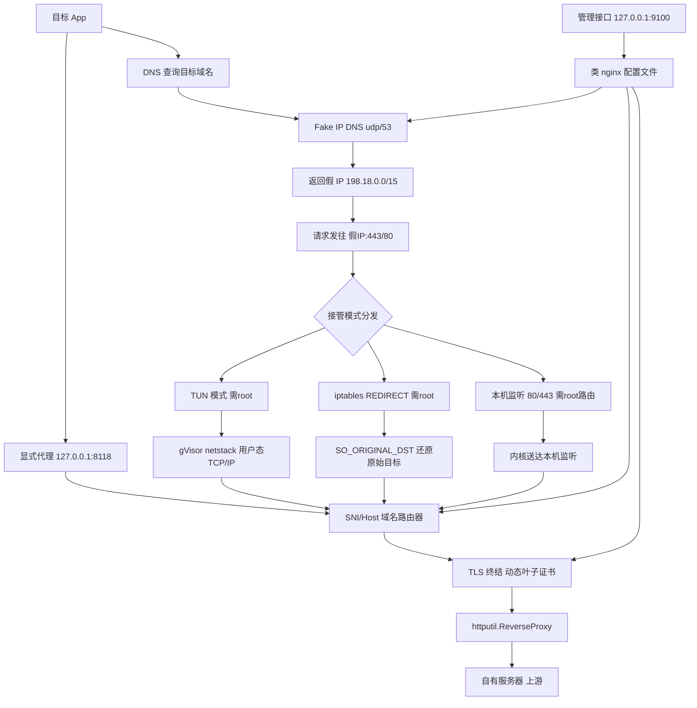

# Device Reverse Proxy (Go 单二进制本地反向代理)

Feature Name: device-reverse-proxy
Updated: 2026-09-24

## Description

Go 实现的设备端本地反向代理服务。单二进制 + 类 nginx 配置文件，通过可插拔的接管模式（显式代理 / DNS 劫持 / TUN / iptables 透明代理）把目标 App 对固定域名的流量引入本地路由器，TLS 中间人终结后按 server/location 规则转发到自有服务器。运行形态为设备 shell 中的常驻进程。

## Architecture



流量路径说明：

1. 目标域名经 Fake IP DNS 解析为 198.18.0.0/15 内虚拟地址，映射表记录假 IP 与域名关系
2. 发往假 IP 的 TCP 流量按所选接管模式进入代理进程，还原出目标域名
3. 路由器按域名匹配 server 块，最长路径前缀匹配 location，经 ReverseProxy 转发上游
4. 未匹配流量按 default_action 处理（direct 直连原目标 / reject 断开）

## Components and Interfaces

```
device-proxy/
├── cmd/proxyd/main.go          # 入口：子命令与 flags
├── internal/config/            # 类 nginx 配置解析与热加载
├── internal/fakeip/            # 假 IP 池与域名映射表
├── internal/dns/               # DNS 劫持服务器（转发 + 假 IP）
├── internal/router/            # 域名/路径路由器
├── internal/mitm/              # CA 管理与动态叶子证书签发
├── internal/proxyserver/       # 显式代理（HTTP 代理协议 + CONNECT）
├── internal/transparent/       # iptables 透明代理（SO_ORIGINAL_DST）
├── internal/tunmode/           # TUN 模式（water + gVisor netstack）
├── internal/upstream/          # ReverseProxy 封装与改写规则
├── internal/admin/             # 本机管理接口
└── configs/proxy.conf          # 示例配置
```

### cmd/proxyd

```
proxyd --config /data/local/tmp/proxy.conf --mode auto --log-level info
proxyd ca --config /data/local/tmp/proxy.conf --out /data/local/tmp/ca.pem
```

- `--mode` 取值：auto / proxy / dns / tun / iptables
  - auto：探测权限，优先 TUN，失败降级显式代理
  - dns：启动 DNS + 80/443 监听（假 IP 流量需 root 路由或 answer=self 局域网模式）
  - iptables：iptables REDIRECT + UDP 53 重定向，需 root
- SIGHUP 触发热加载

### internal/config

自定义递归下降解析器（依赖最小化），解析子集：`server`、`location`、`proxy_pass`、`proxy_set_header`、`dns`、`default_action`、注释。

```go
type Config struct {
    DefaultAction string // "direct" | "reject"
    DNS           DNSConfig
    Servers       []Server
}
type DNSConfig struct {
    Listen   string
    Upstream string
    Hijack   []string
    Answer   string // "fake" | "self"
}
type Server struct {
    Domain string
    Routes []Route
}
type Route struct {
    Prefix             string
    Upstream           *url.URL
    HostOverride       string
    InsecureSkipVerify bool
}
```

配置示例：

```nginx
default_action direct;

dns {
    listen 53;
    upstream 223.5.5.5;
    hijack api.target-app.com cdn.target-app.com;
    answer fake;
}

server api.target-app.com {
    listen 443;
    location /v1/ {
        proxy_pass https://our-server-a.com/v1/;
    }
    location / {
        proxy_pass https://our-server-b.com;
        proxy_set_header Host our-server-b.com;
    }
}

server cdn.target-app.com {
    listen 443;
    location / {
        proxy_pass http://192.168.1.50:8080/;
    }
}
```

### internal/fakeip

- 地址池：198.18.0.0/15（保留基准测试网段，规避与真实路由冲突）
- `Allocate(domain) netip.Addr` / `Lookup(addr) (domain, bool)`，进程内 sync.Map，同一域名映射稳定复用

### internal/dns

- github.com/miekg/dns 实现监听与转发
- 命中 hijack 列表返回假 IP（answer=fake）或代理机自身 IP（answer=self，适配局域网无 root 场景）
- 未命中转发至 upstream；上游异常返回 SERVFAIL

### internal/router

- `Pick(domain, path) (*Route, bool)`：server 块域名精确匹配，location 最长前缀匹配
- SNI 识别：crypto/tls `GetConfigForClient` 读取 ClientHelloInfo.ServerName
- HTTP 识别：请求 Host 头 / CONNECT 目标

### internal/mitm

- 首次启动生成 RSA 4096（或 ECDSA P-256）CA，PEM 持久化配置目录
- 叶子证书按域名缓存（LRU，默认 1024），x509.CreateCertificate 现场签发，SAN 覆盖域名
- 转发 HTTPS 上游默认 `VerifyPeerCertificate` 生效，Route 可配置跳过

### internal/proxyserver

- HTTP 代理协议：绝对 URI 请求直接进路由器
- CONNECT：回 200 后接管裸流，TLS 场景经 SNI 识别；命中域名走 MITM + 路由，未命中按 default_action 透传

### internal/transparent

- iptables 规则由启动脚本/说明文档给出：`-t nat -A OUTPUT -p tcp --dport 443 -j REDIRECT --to-ports 8443`
- 通过 getsockopt(SO_ORIGINAL_DST) 还原原始目标，送入路由器

### internal/tunmode

- github.com/songgao/water 创建 tun0，gVisor netstack（gvisor.dev/gvisor/pkg/tcpip）做用户态 TCP/IP 终结
- 路由与 DNS 重定向命令由启动脚本生成，进程仅负责 TUN 收发

### internal/admin

- 仅绑定 127.0.0.1:9100
- `POST /reload`、`GET /stats`（连接数、假 IP 命中数、路由命中分布）、`POST /log/level`

## Data Models

- 路由表：加载期构建 `map[domain][]Route`，热加载整体原子替换（atomic.Pointer）
- 假 IP 表：`map[netip.Addr]domain`，随进程生命周期
- 证书缓存：`map[domain]*tls.Certificate` + LRU 淘汰
- 请求日志：slog 结构化输出 stdout + 内存环形缓冲（供 /stats 与排障）

## Correctness Properties

1. 同一进程生命周期内，同一目标域名的假 IP 映射保持稳定
2. location 匹配遵循最长前缀；等长前缀冲突时启动期报错
3. 任一被服务域名的叶子证书 SAN 必须覆盖该域名
4. 热加载失败时旧配置继续生效；成功时路由表原子替换，存量连接不受影响
5. 显式代理模式下未匹配域名的透传语义与无代理直连等价

## Error Handling

| 场景 | 处理 |
|------|------|
| TUN 创建权限不足 | 降级显式代理模式，日志输出明确提示 |
| 上游 DNS 不可达 | DNS 返回 SERVFAIL，计数上报 |
| 上游连接失败/超时 | 客户端收到 502，日志记录上游地址与错误 |
| CA 文件损坏 | 重新生成并输出警告，提示需重装证书 |
| 监听端口被占用 | 启动失败并列出冲突端口 |
| 配置语法错误 | 保留旧配置，日志输出行号与原因 |

## Test Strategy

1. 单元测试：config 解析（合法/非法/冲突前缀样例）、fakeip 分配与复用、最长前缀匹配、叶子证书 SAN 断言
2. 集成测试：httptest 模拟上游 + 临时配置文件 + 随机端口，覆盖 HTTP / HTTPS / CONNECT / miss 直连 / 502 / SIGHUP 热加载
3. 构建验证：Makefile 产出 android/arm64、ios/arm64、linux/arm64 三种纯静态二进制并在 CI 校验
4. 设备验收：adb push 二进制与配置 → adb shell 启动 → 设备侧验证目标 App 请求命中路由、管理接口可查询

## References

[^1]: (Website) - gVisor netstack 用户态 TCP/IP 协议栈 https://gvisor.dev/docs/
[^2]: (Website) - water TUN/TAP 库 https://github.com/songgao/water
[^3]: (Website) - miekg/dns DNS 库 https://github.com/miekg/dns
[^4]: (Website) - httputil.ReverseProxy https://pkg.go.dev/net/http/httputil#ReverseProxy
