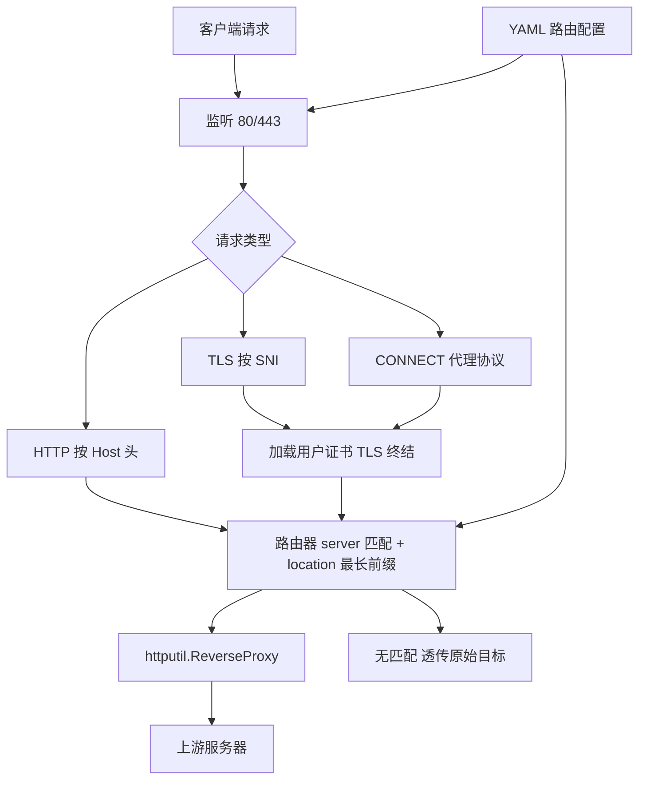

# 我的反向代理 (mrp)

Feature Name: mrp
Updated: 2026-09-24

## Description

我的反向代理（My Reverse Proxy，缩写 mrp）：Go 实现的反向代理服务，全部逻辑收敛在仓库根目录单个 main.go 中。单二进制 + YAML 路由配置（仅承载路由规则），监听 HTTP/HTTPS 端口，按域名（SNI / Host）与路径前缀路由转发到不同上游。TLS 证书由使用者预先创建并经命令行参数指定路径，程序启动时加载。同一监听端口兼容 HTTP 代理协议（CONNECT），可直接作为显式代理使用。证书创建与设备导入步骤见仓库根目录 README.md。

## Architecture



流量路径说明：

1. 客户端流量经设备侧 hosts / DNS 指向或显式代理设置到达监听端口（引导方式由使用者负责）
2. 依据 Host 头或 SNI 识别域名，匹配 server 块；块内按最长路径前缀匹配 location
3. ReverseProxy 完成转发与 Host/路径改写；无匹配域名直接透传原始目标
4. HTTPS 连接使用配置指定的证书完成 TLS 终结，再进入同一路由流程

## Components and Interfaces

仓库根目录单文件结构：

```
mrp/
├── go.mod           # module mrp，依赖 gopkg.in/yaml.v3
├── main.go          # 全部实现逻辑
├── main_test.go     # 单元与集成测试
└── routing.yaml     # 示例路由配置
```

main.go 内部按职责分段组织（同文件内顺序）：

1. flags 与入口：命令行参数解析、SIGHUP 处理
2. 配置结构体与 YAML 解析
3. 路由器：域名/路径匹配
4. TLS：证书加载与 SNI 识别
5. 监听处理：HTTP / HTTPS / CONNECT
6. 转发：httputil.ReverseProxy 封装
7. 日志：slog 请求日志

### CLI 接口

```
mrp --config routing.yaml \
  --http :80 --https :443 \
  --tls-cert certs/server.crt --tls-key certs/server.key \
  --log-level info
```

- `--http` / `--https`：监听地址，默认 `:80` / `:443`；`--https` 为空则仅启动 HTTP 监听
- `--tls-cert` / `--tls-key`：证书与私钥路径，启用 HTTPS 时必填
- SIGHUP 仅热加载路由配置，证书在启动时加载

### 配置解析

gopkg.in/yaml.v3 解析，配置文件只承载路由规则：

```yaml
servers:
  - domain: api.target-app.com
    routes:
      - prefix: /v1/
        upstream: https://our-server-a.com/v1/
      - prefix: /
        upstream: http://192.168.1.50:8080
        host: our-server-b.com
  - domain: cdn.target-app.com
    routes:
      - prefix: /
        upstream: https://our-server-b.com
        tls_verify: false
```

```go
type Config struct {
    Servers []Server `yaml:"servers"`
}
type Server struct {
    Domain string  `yaml:"domain"`
    Routes []Route `yaml:"routes"`
}
type Route struct {
    Prefix    string  `yaml:"prefix"`
    Upstream  string  `yaml:"upstream"`
    Host      string  `yaml:"host"`       // 可选，改写转发 Host 头
    TLSVerify *bool   `yaml:"tls_verify"` // 可选，默认 true
}
```

### 路由器

- `pick(domain, path) (*Route, bool)`：server 块域名精确匹配，路由最长前缀匹配
- SNI 识别：crypto/tls `GetConfigForClient` 读取 ClientHelloInfo.ServerName
- HTTP 识别：请求 Host 头 / CONNECT 目标
- 加载期构建 `map[domain][]Route`，热加载整体原子替换（atomic.Pointer）

### 监听与转发

- HTTP 监听：读取 Host 头进路由器
- HTTPS 监听：tls.Server + GetConfigForClient 完成 SNI 识别，证书来自配置加载的 tls.Certificate
- CONNECT：回 200 后接管裸流，按目标地址透传或经 SNI 路由（复用 HTTPS 流程）
- 转发统一走 httputil.ReverseProxy，Rewrite 函数处理 Host 改写与路径前缀映射，ErrorHandler 返回 502
- 日志：slog 结构化输出 stdout：domain、path、matched rule、upstream、status、latency，级别经 --log-level 控制

## Data Models

- 路由表：`map[domain][]Route`，热加载原子替换
- TLS：启动时从命令行参数路径加载 `tls.Certificate`

## Correctness Properties

1. 路由匹配遵循最长前缀；等长前缀冲突时启动期报错
2. 加载的服务端证书 SAN 覆盖全部被服务域名（由使用者生成证书时保证，README 提供命令）
3. 热加载失败时旧配置继续生效；成功时路由表原子替换，存量连接不受影响
4. 无匹配域名透传语义与无代理直连等价

## Error Handling

| 场景 | 处理 |
|------|------|
| 上游连接失败/超时 | 客户端收到 502，日志记录上游地址与错误 |
| 监听端口被占用 | 启动失败并列出冲突端口 |
| YAML 语法错误 | 保留旧配置，日志输出错误行号与原因 |
| 证书文件缺失或解析失败 | 启动失败，输出证书路径与原因 |
| 客户端未信任导入的 CA | 客户端证书报错；按 README 步骤导入 CA |

## Test Strategy

1. 单元测试（main_test.go）：YAML 解析（合法/非法/冲突前缀样例）、最长前缀匹配、证书加载
2. 集成测试：httptest 模拟上游 + 测试内临时生成的证书 + 随机端口，覆盖 HTTP / HTTPS / CONNECT / 无匹配透传 / 502 / SIGHUP 热加载
3. 构建验证：构建脚本产出 mrp-android-arm64、mrp-ios-arm64、mrp-linux-arm64、mrp-windows-amd64.exe 四种纯静态二进制并在 CI 校验

## References

[^1]: (Website) - httputil.ReverseProxy https://pkg.go.dev/net/http/httputil#ReverseProxy
[^2]: (Website) - crypto/tls ClientHelloInfo https://pkg.go.dev/crypto/tls#ClientHelloInfo
[^3]: (Website) - yaml.v3 https://pkg.go.dev/gopkg.in/yaml.v3
