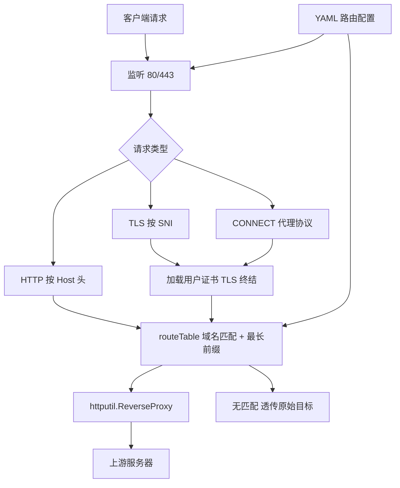
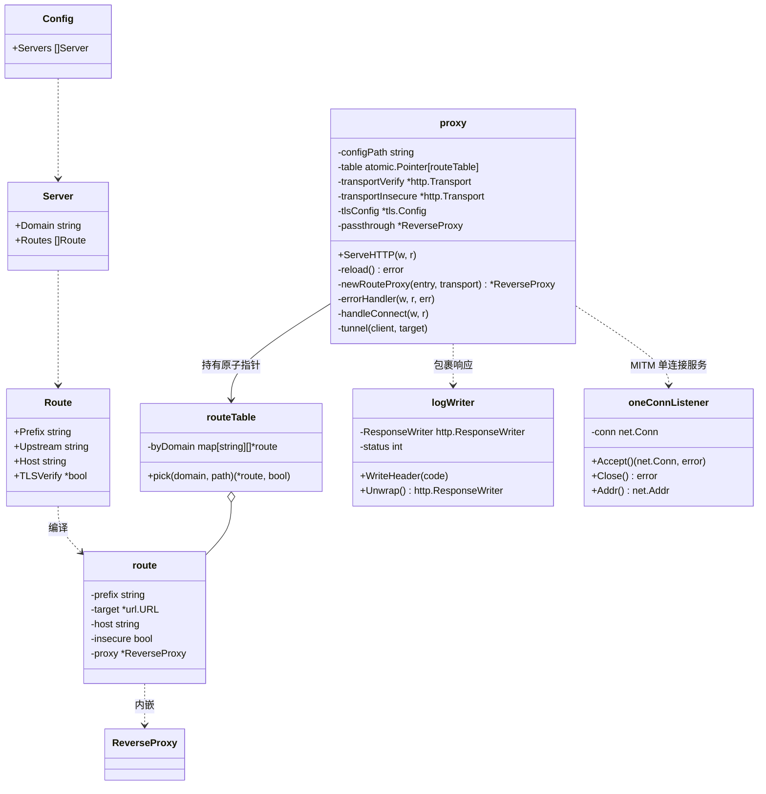
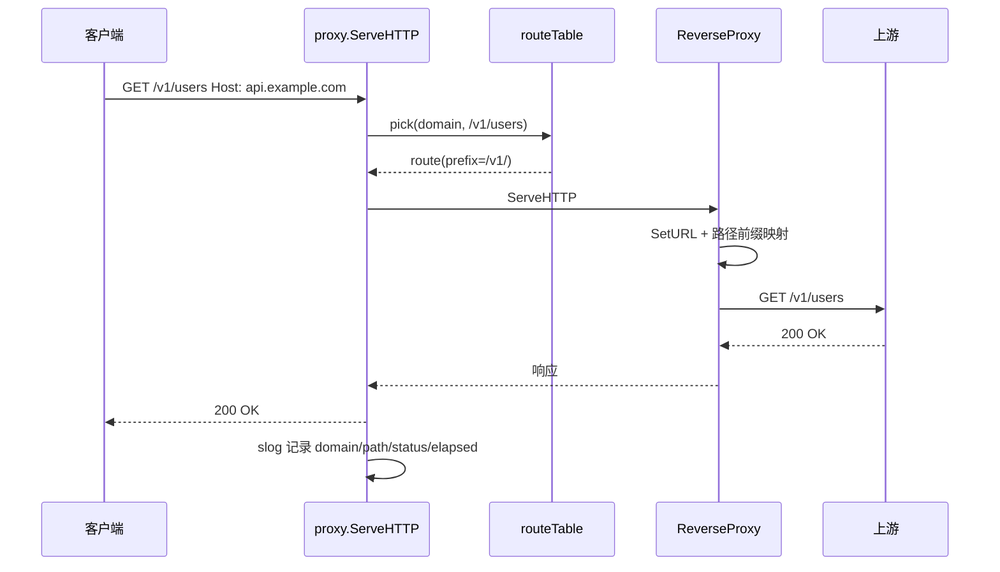
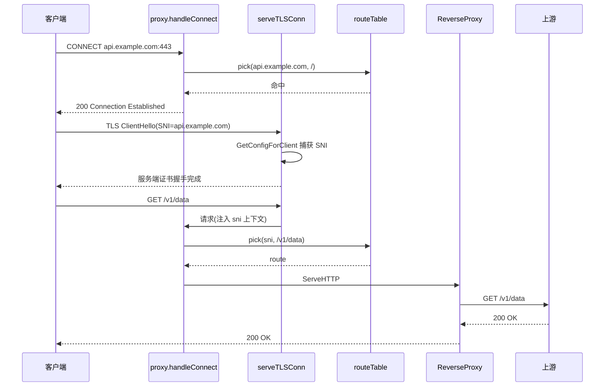

# 我的反向代理 (mrp)

Feature Name: mrp
Updated: 2026-09-24

## Description

我的反向代理（My Reverse Proxy，缩写 mrp）：Go 实现的反向代理服务，源码按职责拆分为多个文件，构建产物为单一静态二进制。YAML 路由配置（仅承载路由规则），监听 HTTP/HTTPS 端口，按域名（SNI / Host）与路径前缀路由转发到不同上游。TLS 证书由使用者预先创建并经命令行参数指定路径，程序启动时加载。同一监听端口兼容 HTTP 代理协议（CONNECT），可直接作为显式代理使用。证书创建与设备导入步骤见仓库根目录 README.md。

## Architecture



流量路径说明：

1. 客户端流量经设备侧 hosts / DNS 指向或显式代理设置到达监听端口（引导方式由使用者负责）
2. 依据 Host 头或 SNI 识别域名，匹配 server 块；块内按最长路径前缀匹配路由
3. ReverseProxy 完成转发与 Host/路径改写；无匹配域名直接透传原始目标
4. HTTPS 连接使用命令行参数指定的证书完成 TLS 终结，再进入同一路由流程

## File Layout

仓库根目录按职责拆分（保持精简，单 package main）：

```
mrp/
├── go.mod            # module mrp，依赖 gopkg.in/yaml.v3
├── main.go           # 入口：flags、信号循环、run、fatal
├── config.go         # YAML 配置结构与 loadTable 解析
├── route.go          # route / routeTable 与 pick
├── proxy.go          # proxy 结构：路由、转发、CONNECT、tunnel
├── server.go         # TLS 监听、SNI 注入、oneConnListener、辅助函数、logWriter
├── main_test.go      # 单元与集成测试
├── routing.yaml      # 示例路由配置
├── README.md         # 证书创建与设备导入指引
└── AGENTS.md         # 代码规范
```

职责边界：

- `config.go` 仅负责把 YAML 解析为 `routeTable`，不依赖 proxy / 传输
- `route.go` 仅负责路由匹配数据结构，纯函数无副作用
- `proxy.go` 持有运行期依赖（传输、TLS、路由表原子指针），编排请求处理
- `server.go` 处理连接级服务（TLS 握手、SNI 注入、单连接 listener）与无状态工具函数

## CLI

```
mrp --config routing.yaml \
  --http :80 --https :443 \
  --tls-cert certs/server.crt --tls-key certs/server.key \
  --log-level info
```

- `--http` / `--https`：监听地址，默认 `:80` / `:443`；传空禁用
- `--tls-cert` / `--tls-key`：证书与私钥路径，启用 HTTPS 时必填
- SIGHUP 仅热加载路由配置，证书在启动时加载

## Configuration

gopkg.in/yaml.v3 解析，配置文件只承载路由规则：

```yaml
servers:
  - domain: api.target-app.com
    routes:
      - prefix: /v1/
        upstream: https://our-server-a.com/v1/
      - prefix: /
        upstream: http://192.168.1.50:8080
        host: our-server-b.com
  - domain: cdn.target-app.com
    routes:
      - prefix: /
        upstream: https://our-server-b.com
        tls_verify: false
```

```go
type Config struct {
    Servers []Server `yaml:"servers"`
}
type Server struct {
    Domain string  `yaml:"domain"`
    Routes []Route `yaml:"routes"`
}
type Route struct {
    Prefix    string `yaml:"prefix"`
    Upstream  string `yaml:"upstream"`
    Host      string `yaml:"host"`
    TLSVerify *bool  `yaml:"tls_verify"`
}
```

注：YAML 反射要求结构体字段导出（大驼峰），其余类型与字段遵循 Go 惯例 camelCase，详见 AGENTS.md。

## UML Class Diagram



## Sequence Diagrams

### HTTP 请求路由转发



### HTTPS 经 CONNECT 的 MITM 流程



## Correctness Properties

1. 路由匹配遵循最长前缀；同域等长前缀冲突时加载期报错
2. 加载的服务端证书 SAN 覆盖全部被服务域名（由使用者生成证书时保证，README 提供命令）
3. 热加载失败时旧路由表继续生效；成功时 `atomic.Pointer` 原子替换，存量连接不受影响
4. 无匹配域名透传语义与无代理直连等价

## Error Handling

| 场景 | 处理 |
|------|------|
| 上游连接失败/超时 | errorHandler 返回 502，日志记录上游地址与错误 |
| 监听端口被占用 | fatal 退出并列出冲突端口 |
| YAML 语法错误 | reload 返回错误，保留旧路由表，日志输出原因 |
| 证书文件缺失或解析失败 | 启动失败，输出证书路径与原因 |
| 客户端未信任导入的 CA | 客户端证书报错；按 README 步骤导入 CA |

## Test Strategy

1. 单元测试（main_test.go）：`loadTable` 合法/非法/冲突前缀样例、`pick` 最长前缀匹配
2. 集成测试：httptest 模拟上游 + 测试内临时生成证书 + 随机端口，覆盖 HTTP 路由 / Host 改写 / 透传 / HTTPS 经 CONNECT 的 MITM / 502 / reload 热加载切换路由
3. 构建验证：交叉编译产出 android/arm64、ios/arm64、linux/arm64、windows/amd64 纯静态二进制

## References

[^1]: (Website) - httputil.ReverseProxy https://pkg.go.dev/net/http/httputil#ReverseProxy
[^2]: (Website) - crypto/tls ClientHelloInfo https://pkg.go.dev/crypto/tls#ClientHelloInfo
[^3]: (Website) - yaml.v3 https://pkg.go.dev/gopkg.in/yaml.v3
