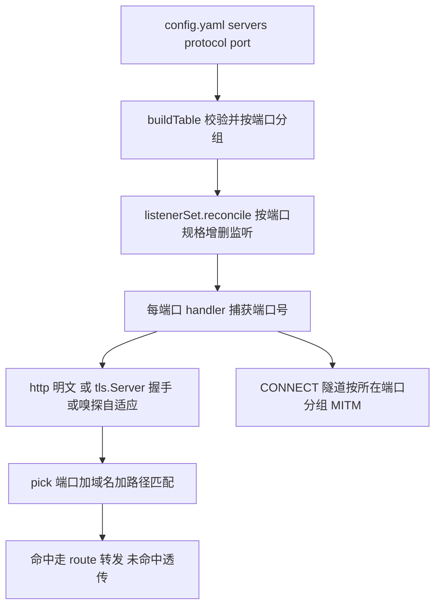

# Server 入口端口与协议

Feature Name: server-port-protocol
Updated: 2026-09-30

## Description

将接入模型改为 nginx 风格：每个 server 声明 `protocol: http|https`，省略则自适应（按连接首字节识别 http/https），`port` 可选（省略按协议取默认端口 https:443 / 其余:80），监听端口完全由配置决定。`--port` 全局端口参数移除；协议嗅探仅保留在省略 `protocol` 的端口；`serveConnect` 的隧道 MITM 行为保持，按建立隧道的端口分组匹配。

已确认的设计决策：

1. **无全局端口**：`--port` 参数移除，监听端口完全由配置决定；配置无 server 时不监听任何端口并输出提示，热加载可后续新增。
2. **协议决定默认端口**：`protocol` 省略留空表示自适应（按连接首字节识别 http/https）；`port` 省略按协议取默认端口（https:443 / 其余:80）；显式 `http`/`https` 的监听协议固定，自适应端口才启用嗅探（`sniffConn`）。
3. **域名绑定端口**：`(port, domain)` 唯一；同一域名可分别声明 http 与 https 条目；自适应端口内同一域名可同时接受 http 与 https 连接。
4. **upstream 简写**：省略 scheme 按 http（80/自定义端口）；本地目录识别改为"含 `/` 或 `\` 分隔符"规则；带其他 scheme 前缀显式报错。

## Architecture



数据流：`reload` 先解析并校验配置构建新表，随后 `listenerSet.reconcile` 对比新旧端口规格（先建新、失败回滚、后关旧），监听就绪后才原子替换路由表。每条监听绑定捕获了自身端口的 handler；http 端口直接明文服务（CONNECT 隧道照常处理），https 端口直接包 `tls.Server` 按 SNI 现场签发，省略协议时 `sniffConn` 按首字节分辨 http/https。

## Components and Interfaces

| 文件 | 改动 |
|------|------|
| `config.go` | `Domain` 增加 `Port int \`yaml:"port"\``、`Protocol string \`yaml:"protocol"\``；`buildTable` 解析协议/端口（省略留空自适应）并按端口分组校验；`parseUpstream` 重写支持简写；`loadTable(path)` 签名不变 |
| `route.go` | `routeTable.byPort map[int]*portGroup`；`pick(port, domain, path)`、`has(port, domain)`；`listenerSpecs()` 汇总端口规格；`fingerprint` 纳入 port/protocol |
| `listener.go`（新增） | `listenerSpec{port, protocol}`、`listenerSet`：`reconcile(specs, tlsConfig, handlerFactory)` 增删监听、`closeAll`；单条监听一个 goroutine 跑 `serve` |
| `server.go` | `serve`/`handleConn` 增加 protocol 参数：`http` 明文直服、`https` 直接包 `tls.Server`、留空用 `sniffConn` 首字节嗅探（`tlsRecordHandshake`/`protoDetectWait`/`bufferedConn` 保留） |
| `proxy.go` | 持有 `listenerSet`；`reload` 编排"先监听后换表"，https 端口无 CA 时先报错；`routeHandler(request, port)`；`serveConnect`/隧道内层服务按端口透传 |
| `main.go` | 移除 `-port` flag；`run` 不再自建监听（reconcile 在 reload 内完成），启动失败走 `fatalf` |
| `AGENTS.md` | 文件职责表新增 `listener.go` 行，更新 server.go/main.go 职责描述 |
| `mrp.bat` | `PORT` 常量 4000 → 80，注明须与配置监听端口一致（保持 CRLF/纯 ASCII） |

## Data Models

```yaml
servers:
  - domain: api.target-app.com
    port: 8443          # 可选，省略按协议取默认端口
    protocol: https     # 可选：http | https，省略则自适应
    routes:
      - prefix: /
        upstream: 192.168.1.50:8080   # 简写：http + 自定义端口
  - domain: api.target-app.com
    routes:                           # 同域名 http:80 条目
      - prefix: /
        upstream: ./dist
```

```go
type Domain struct {
    Name     string  `yaml:"domain"`
    Port     int     `yaml:"port"`     // 0 = 省略，按协议取默认端口
    Protocol string  `yaml:"protocol"` // "" / "http" / "https"，省略留空自适应
    Routes   []Route `yaml:"routes"`
}

// portGroup 一个监听端口的分组：协议与端口绑定，域名唯一
type portGroup struct {
    protocol string // "" 自适应 / "http" / "https"
    byDomain map[string][]*route
}

type routeTable struct {
    byPort map[int]*portGroup
}

type listenerSpec struct {
    port     int
    protocol string
}
```

解析规则（`buildTable`）：

1. `protocol` 空串留空表示自适应（按连接首字节识别），其余仅接受 `http`/`https`。
2. `port` 为 0 视为省略，按协议取默认端口（https 443 / 其余 80）；显式取值须在 1-65535。
3. 同端口协议必须一致；`(port, domain)` 重复报错；同域名跨端口允许。

upstream 简写解析规则（`parseUpstream`）：

1. 含 `://` → 走 `url.Parse`，scheme 为 http/https 则远程转发，否则报 `unsupported upstream scheme`。
2. 含 `/` 或 `\` → 本地静态目录（覆盖 `./dist`、`/var/www`、`C:\web`）。
3. 其余按 `host[:port]` 简写：`net.SplitHostPort` 拆分（支持 `[IPv6]:port`），端口须为 1-65535，构造 `url.URL{Scheme: "http", Host: ...}`；无端口时 Host 保持裸 host（Go 传输层默认 80）。

## Correctness Properties

1. 每个端口的协议唯一且 ∈ {"", http, https}；`(port, domain)` 全局唯一。
2. `pick(port, ...)` / `has(port, ...)` 只查 `byPort[port]` 分组，端口间互不可见。
3. reload 任一环节失败（解析、校验、CA 缺失、监听建立）时，旧监听与旧路由表保持原样；监听建立采用"先建新、失败回滚新增、后关旧"的顺序保证这一点。
4. 路由表指纹覆盖 port 与 protocol，配置未变时跳过重建与 reconcile，存量连接不中断。
5. 关闭监听仅停止 Accept，已接受连接由各自 goroutine 自然结束。
6. CONNECT 隧道内层服务使用建立隧道时的端口分组，隧道外域名未命中仍透传隧道。

## Error Handling

| 场景 | 处理 |
|------|------|
| YAML 解析错误 / 未知字段 | 拒绝加载，保留旧表（现有行为） |
| `protocol` 非法、`port` 越界、同端口协议冲突、`(port, domain)` 重复 | `buildTable` 报错，拒绝加载 |
| https 端口存在但未配置 CA | reload 报错提示需要证书，保留旧监听旧表 |
| 端口被占用 / 无权限（Linux 非特权绑 80） | `reconcile` 回滚本次新增监听，报含端口与原因的错误日志；启动期则 `fatalf` |
| http 端口收到 TLS 握手字节 | 交由 http.Server 以 400 拒绝，连接关闭 |
| 自适应端口收到 TLS 连接但无 CA 证书 | 记录警告并关闭连接；reload 校验以显式 https 端口为准 |
| https 端口无 SNI | 现有 `getCertificate` 报错，握手失败 |
| 域名/端口未命中 | 透传原目标（现有 passthrough） |
| 配置无 server | 不监听任何端口，输出提示日志，等待热加载 |

## Test Strategy

- **parseUpstream 表驱动**：`host`、`host:port`、`[::1]:8080`、完整 URL（含路径映射）、`./dist`、`/var/www`、`C:\web`、`ftp://x` 报错、`host:` 与越界端口报错、裸域名按远程解析。
- **buildTable 校验**：协议/端口推导（省略 protocol 留空自适应、https → 443、其余 → 80）、port 越界、protocol 非法、同端口协议冲突、`(port, domain)` 重复、同域名跨端口允许、旧配置（无新字段）按自适应:80 解析。
- **pick/has 端口绑定**：自定义端口命中、跨端口透传、`has(port, domain)` 隧道分发。
- **集成（httptest + 随机端口）**：双 server 双端口转发；空配置无监听、热加载新增端口后开始监听；删除端口后停止；reload 失败保留旧监听；https 端口用 `selfSignedCert` 走真实 TLS 请求；http 端口发送 TLS 握手字节被拒绝；自适应端口同一端口既服务 HTTP 明文又服务 TLS 直连；CONNECT 隧道 MITM 按端口分组。
- 提交前 `gofmt -w *.go`、`go vet ./...`、`go build -o mrp .`、`go test ./...` 全绿。

## 实施顺序

1. `config.go`：字段、协议/端口推导与校验、`parseUpstream` 重写（含配套单测）。
2. `route.go`：`byPort` 分组、`pick`/`has` 带端口、`listenerSpecs`、指纹扩展（含单测）。
3. `server.go`：`handleConn` 协议分派，保留嗅探供自适应端口使用。
4. `listener.go`：`listenerSet` 与 reconcile。
5. `proxy.go` + `main.go`：reload 编排、隧道端口穿线、移除 `-port` flag（含集成测试）。
6. 文档与脚本：`defaultConfig` 模板注释、README（含升级变化标注）、AGENTS.md 文件表、mrp.bat `PORT=80`。

## References

[^1]: (Filename#L62) - config.go Domain 定义
[^2]: (Filename#L139) - route.go routeTable 与 pick
[^3]: (Filename#L68) - server.go serve/handleConn
[^4]: (Filename#L155) - proxy.go serveConnect 隧道分发
[^5]: (Filename#L192) - main.go run 监听启动
