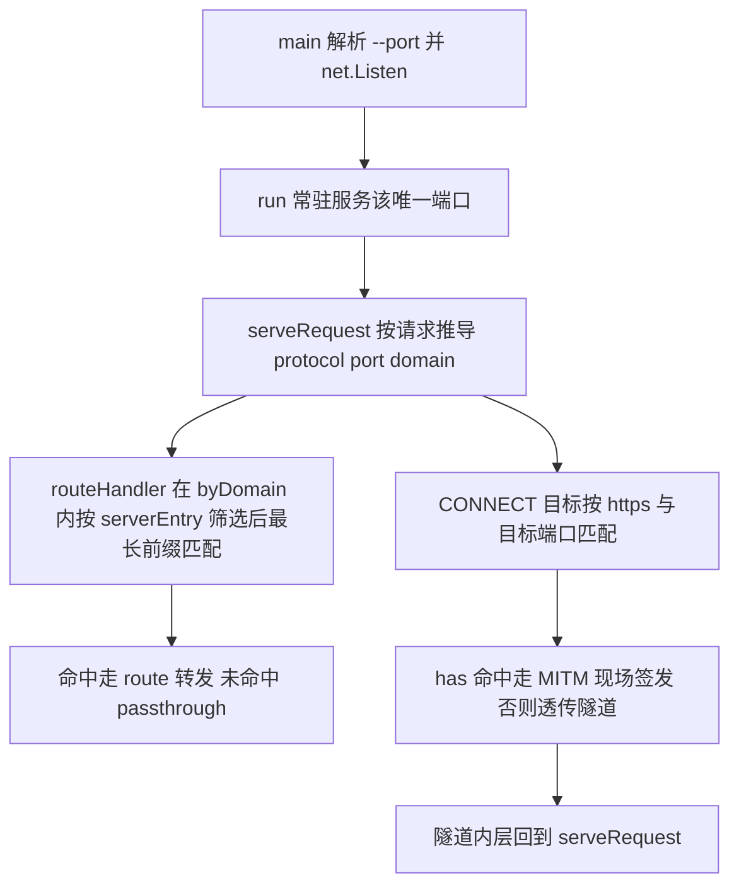

# 单端口代理与虚拟服务器匹配

Feature Name: server-port-protocol
Updated: 2026-09-30

## Description

mrp 收敛为单端口代理模型：只监听一个端口（`--port`，默认 8000），配置里的 `protocol` 与 `port` 从监听规格降级为虚拟服务器匹配条件——决定哪个请求归属哪个 server，两者均不参与监听。协议与端口从请求内容推导：非 CONNECT 请求取 URL scheme 与目标端口（省略端口按协议补默认 80/443），CONNECT 视为 https 并按目标主机端口；隧道解密后的请求按 https + Host 匹配。CONNECT 命中配置的域名走 MITM，未命中走透传隧道。

已确认的设计决策：

1. **单端口监听**：`--port` 恢复为唯一监听端口参数（默认 8000，校验 1-65535），监听在 `main` 内一次性建立，`reload` 不再增减监听，配置热加载只替换路由表。
2. **protocol 保留并按请求 scheme 匹配**：`protocol` 省略匹配任意协议，显式 `http`/`https` 只接对应协议请求；不参与监听，mrp 恒在 `--port` 上监听明文连接。
3. **port 匹配请求目标端口**：`port` 省略匹配任意端口，显式取值只接该目标端口的请求；`(domain, protocol, port)` 组合唯一。
4. **去掉自适应嗅探**：监听恒为明文，不存在按首字节识别协议的端口，`sniffConn` 及其 TLS 记录握手判定整体删除。
5. **去掉加载期 CA 校验**：无 CA 时 CONNECT 直接透传隧道，mrp 无 CA 也能提供 HTTP 路由与隧道能力；命中域名但无 CA 时返回 502 并输出警告。
6. **upstream 简写**：省略 scheme 按 http（80/自定义端口）；本地目录识别为"含 `/` 或 `\` 分隔符"规则；带其他 scheme 前缀显式报错。

## Architecture



数据流：`reload` 解析并校验配置构建新表，比对指纹后 `installHandlers` 构建处理器并原子替换路由表，随后清空上游连接池、DNS 缓存与已签发证书缓存；监听不动，存量连接继续由旧表服务至自然结束。

## Components and Interfaces

| 文件 | 改动 |
|------|------|
| `config.go` | `Domain` 保留 `Port int`、`Protocol string` 字段但语义改为匹配条件；`resolveEntry` 返回 `*serverEntry`（省略留空/0）；`routeTable.add` 按 `(domain, protocol, port)` 校验重复；新增 `protocolLabel`；`defaultPort`/`validPort` 中默认端口推导删除；`defaultConfig` 模板注释同步 |
| `route.go` | `portGroup`/`byPort` 改为 `serverEntry{protocol, port, routes}` 与 `routeTable.byDomain map[string][]*serverEntry`；新增 `serverEntry.matches(protocol, port)`；`pick(protocol, port, domain, path)`、`has(protocol, port, domain)`；`listenerSpecs`/`hasHTTPSPort` 删除；`fingerprint` 纳入 protocol 与 port |
| `server.go` | `serve(listener, handler)` 始终明文服务；`handleConn`/`sniffConn`/`tlsRecordHandshake`/`protoDetectWait` 删除；`bufferedConn` 保留供 hijack 预读 |
| `proxy.go` | 删除 `listenerSpec`/`listenerEntry`/`listenerSet`/`reconcile`/`closeAll`/`portHandler` 与 `listeners` 字段；新增 `handler()`（供 `serve` 与隧道内层共用）、`targetOf`、`hostAndPort`、`effectivePort`、`defaultPort`；`serveConnect` 按 `(protocol, port, domain)` 分派 MITM 与隧道；`reload` 删除 CA 校验与 reconcile |
| `main.go` | 恢复 `--port` flag（默认 `defaultListenPort` = 8000，校验 1-65535）；`main` 先 `net.Listen` 后 `buildProxy`；`run(listener, proxy)`、`serveSignals(listener, proxy)` |
| `main_test.go` | 监听集与自适应用例删除，改为 `startListener(t, p)` 起单端口监听；`pick`/`has` 带协议与端口；新增协议匹配与无 CA 502 断言 |
| `AGENTS.md` | 文件职责表更新 route.go/proxy.go/server.go/main.go 行，删除监听集描述，补 `--port` 单端口模型 |
| `README.md` | 原理图与接入方式改为 CONNECT + MITM；字段表说明 protocol/port 仅参与匹配；flags 表补 `--port`；示例端口统一 8000 |

## Data Models

```yaml
servers:
  - domain: api.target-app.com
    protocol: https      # 可选，匹配请求协议；省略匹配任意协议，不参与监听
    port: 443            # 可选，匹配请求目标端口；省略匹配任意端口，不参与监听
    routes:
      - prefix: /
        upstream: 192.168.1.50:8080   # 简写：http + 自定义端口
  - domain: api.target-app.com        # 同域名另一条：任意协议任意端口
    routes:
      - prefix: /
        upstream: ./dist
```

```go
// serverEntry 一个虚拟服务器：按 protocol 与 port 筛选请求，命中条目内按最长前缀匹配
type serverEntry struct {
    protocol string // "" 匹配任意 / "http" / "https"
    port     int    // 0 匹配任意 / 1-65535
    routes   []*route
}

type routeTable struct {
    byDomain map[string][]*serverEntry
}

func (s *serverEntry) matches(protocol string, port int) bool
func (t *routeTable) pick(protocol string, port int, domain, path string) (*route, bool)
func (t *routeTable) has(protocol string, port int, domain string) bool
```

匹配规则（`matches`）：`protocol` 为空或等于请求协议，且 `port` 为 0 或等于请求端口。

解析规则（`resolveEntry`）：

1. `protocol` 仅接受空串、`http`、`https`，其余报不支持的协议。
2. `port` 为 0 视为省略匹配任意端口；显式取值须在 1-65535。
3. `(domain, protocol, port)` 重复报错，域名可跨条目重复。

请求协议与端口推导（`targetOf`）：

1. CONNECT：协议 https，端口取 `Host` 中的端口，省略或非法取 443。
2. URL 含 scheme（代理绝对形式）：取 `URL.Scheme` 与 `URL` 端口，省略按协议补 80/443。
3. URL 无 scheme（隧道内层的源形式请求）：按连接是否 TLS 取协议，`Host` 头取域名，端口省略按协议补 80/443。

upstream 简写解析规则（`parseUpstream`）：

1. 含 `://` → 走 `url.Parse`，scheme 为 http/https 则远程转发，否则报 `unsupported upstream scheme`。
2. 含 `/` 或 `\` → 本地静态目录（覆盖 `./dist`、`/var/www`、`C:\web`）。
3. 其余按 `host[:port]` 简写：`net.SplitHostPort` 拆分（支持 `[IPv6]:port`），端口须为 1-65535，构造 `url.URL{Scheme: "http", Host: ...}`；无端口时 Host 保持裸 host（Go 传输层默认 80）。

## Correctness Properties

1. 每个域名下的虚拟服务器条目 `(protocol, port)` 互不相同；`protocol` 为空表示匹配任意协议，`port` 为 0 表示匹配任意端口。
2. `pick(protocol, port, domain, path)` / `has(protocol, port, domain)` 只查 `byDomain[domain]`，域名间互不可见。
3. 监听不在 `reload` 内变更；`reload` 任一环节失败（解析、校验、安装处理器）时旧路由表与监听保持原样。
4. 路由表指纹覆盖 protocol 与 port，配置未变时跳过重建与缓存清空，存量连接不中断。
5. CONNECT 命中判定与隧道内层路由使用同一匹配条件，隧道内域名的匹配与明文请求一致。
6. 隧道外未命中域名只搬运字节，不读取或改写载荷。

## Error Handling

| 场景 | 处理 |
|------|------|
| YAML 解析错误 / 未知字段 | 拒绝加载，保留旧表 |
| `protocol` 非法、`port` 越界、`(domain, protocol, port)` 重复 | `buildTable` 报错，拒绝加载 |
| `--port` 越界 / 绑定失败（占用、无权限） | 启动期 `fatalf` 终止 |
| CONNECT 命中域名但无 CA 证书 | 返回 502，输出警告日志 |
| CONNECT 未命中域名 | 透传隧道到原目标 |
| 上游不可达 | 502，不透出传输层错误细节 |
| 域名或协议端口未命中 | 透传原目标（现有 passthrough） |
| 隧道内层 TLS 握手缺少 SNI | `getCertificate` 报错，握手失败 |

## Test Strategy

- **parseUpstream 表驱动**：`host`、`host:port`、`[::1]:8080`、完整 URL（含路径映射）、`./dist`、`/var/www`、`C:\web`、`ftp://x` 报错、`host:` 与越界端口报错、裸域名按远程解析。
- **buildTable 校验**：协议与端口省略留空、protocol 非法、port 越界、`(domain, protocol, port)` 重复、同域名多条不同条件允许、旧配置（无新字段）按任意协议任意端口解析。
- **pick/has 匹配**：协议命中与未命中、端口 0 匹配任意、最长前缀、`has(protocol, port, domain)` 隧道分发、跨域名隔离。
- **集成（httptest + 随机端口）**：明文转发与 CONNECT 隧道透传；CONNECT 命中域名走 MITM 并以 CA 信任根校验证书链；`protocol: https` 条目只接 CONNECT、明文 GET 不命中；未配 CA 时 CONNECT 回 502；嵌套 CONNECT；CONNECT 与数据同批到达的字节保留；热加载切换路由与清缓存。
- 提交前 `gofmt -w *.go`、`go vet ./...`、`go build -o mrp .`、`go test ./...` 全绿。

## 实施顺序

1. `route.go`：`serverEntry`/`byDomain`、`matches`/`pick`/`has`、指纹扩展（含单测）。
2. `config.go`：`resolveEntry`/`add`/`protocolLabel`、默认端口推导删除、`defaultConfig` 模板注释。
3. `server.go`：`serve` 简化，删除自适应嗅探。
4. `proxy.go`：删除监听集与 reconcile，新增 `handler`/`targetOf` 推导，`serveConnect` 按条件分派。
5. `main.go`：恢复 `--port`，监听在 `main` 内建立。
6. 测试与文档：`main_test.go` 用例调整、README、AGENTS.md、本 spec 同步。

## References

[^1]: (Filename#L73) - config.go Domain 定义
[^2]: (Filename#L148) - route.go serverEntry.matches 与 routeTable
[^3]: (Filename#L65) - server.go serve
[^4]: (Filename#L219) - proxy.go serveConnect 隧道分发
[^5]: (Filename#L119) - proxy.go targetOf 请求协议与端口推导
[^6]: (Filename#L202) - main.go run 唯一端口常驻服务
