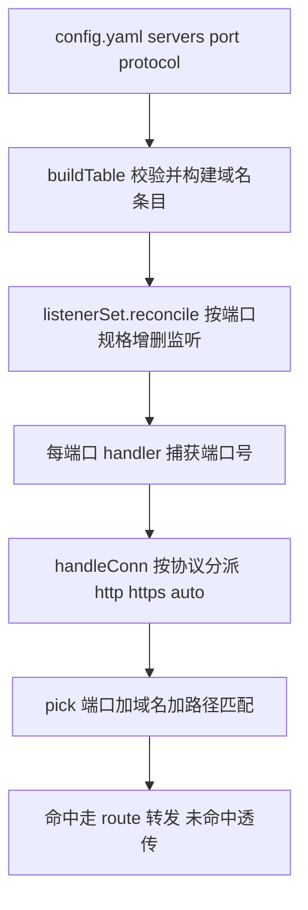

# Server 入口端口与协议

Feature Name: server-port-protocol
Updated: 2026-09-30

## Description

为 `servers[].domain` 增加可选 `port` 与 `protocol` 字段：声明 `port` 的 server 由代理服务动态建立独立监听，`protocol: http|https` 固定该端口接入协议，均省略时保持现状（全局 `--port` + 按连接嗅探）。域名匹配与端口绑定：server 只在自己声明的端口上被命中，其余端口按未命中透传。

已确认的设计决策：

1. **全局端口 + 动态监听**：未写 `port` 的 server 继续绑定 `--port`；自定义端口随热加载自动开/关，reload 失败保留旧监听。
2. **`protocol: http|https`**：省略 = 自动嗅探（现状）；`http` 只收明文；`https` 只收 TLS（SNI + CA 现场签发）。
3. **域名绑定端口**：声明 `port` 的域名只在该端口匹配，到达其他端口透传。
4. **upstream 简写**：省略 scheme 按 http（80/自定义端口）；本地目录识别改为"含 `/` 或 `\` 分隔符"规则，消除裸域名被静默当目录的坑；带其他 scheme 前缀显式报错。

## Architecture



数据流：`reload` 先解析并校验配置构建新表，随后 `listenerSet.reconcile` 对比新旧端口规格（先建新、失败回滚、后关旧），监听就绪后才原子替换路由表。每条监听绑定捕获了自身端口的 handler，连接经 `handleConn` 按 `protocol` 分派后进入统一的 `pick(port, domain, path)`。

## Components and Interfaces

| 文件 | 改动 |
|------|------|
| `config.go` | `Domain` 增加 `Port int \`yaml:"port"\``、`Protocol string \`yaml:"protocol"\``；`buildTable`/`buildRoutes` 增加端口与协议校验；`loadTable(path, defaultPort)`；`parseUpstream` 重写支持简写 |
| `route.go` | `routeTable.byDomain` 值改为 `*domainEntry{port, protocol, routes}`；`pick(port, domain, path)`；`fingerprint` 纳入 port/protocol |
| `listener.go`（新增） | `listenerSpec{port, protocol}`、`listenerSet`：`reconcile(specs, handlerFactory)` 增删监听、`stop` 全部关闭；单条监听一个 goroutine 跑 `serve` |
| `server.go` | `handleConn`/`serve` 增加 protocol 参数：`http` 跳过嗅探直接明文服务、`https` 直接包 `tls.Server`、`""` 走现有嗅探 |
| `proxy.go` | 持有 `listenerSet` 与 `defaultPort`；`reload` 编排"先监听后换表"；`routeHandler(request, port)`；`ServeHTTP` 改为按端口创建的闭包 |
| `main.go` | `run` 用 `listenerSet` 启动初始监听，失败走 `fatalf`；`loadTable` 调用传入 `opts.port` |
| `AGENTS.md` | 文件职责表新增 `listener.go` 行 |

## Data Models

```yaml
servers:
  - domain: api.target-app.com
    port: 8443          # 可选，缺省绑定 --port
    protocol: https     # 可选：http | https，缺省自动嗅探
    routes:
      - prefix: /
        upstream: 192.168.1.50:8080   # 简写：http + 自定义端口
  - domain: web.local
    routes:
      - prefix: /
        upstream: ./dist
```

```go
type Domain struct {
    Name     string  `yaml:"domain"`
    Port     int     `yaml:"port"`     // 0 = 全局端口
    Protocol string  `yaml:"protocol"` // "" / "http" / "https"
    Routes   []Route `yaml:"routes"`
}

// domainEntry 域名条目：入口端口与协议随路由一并构建，加载后只读
type domainEntry struct {
    port     int
    protocol string
    routes   []*route
}

type routeTable struct {
    byDomain map[string]*domainEntry
}

// servesOn 端口绑定判定：port 为 0 表示绑定全局端口
func (e *domainEntry) servesOn(port, defaultPort int) bool {
    if e.port == 0 {
        return port == defaultPort
    }
    return e.port == port
}

type listenerSpec struct {
    port     int
    protocol string // "" = 自动嗅探
}
```

upstream 简写解析规则（`parseUpstream`）：

1. 含 `://` → 走 `url.Parse`，scheme 为 http/https 则远程转发，否则报 `unsupported upstream scheme`。
2. 含 `/` 或 `\` → 本地静态目录（覆盖 `./dist`、`/var/www`、`C:\web`）。
3. 其余按 `host[:port]` 简写：`net.SplitHostPort` 拆分（支持 `[IPv6]:port`），端口须为 1-65535，构造 `url.URL{Scheme: "http", Host: ...}`；无端口时 Host 保持裸 host（Go 传输层默认 80）。

## Correctness Properties

1. 同一端口上所有 server 的 `protocol` 一致或全部省略；绑定全局端口的 server 一律省略 `protocol`。
2. 自定义端口取值 ∈ [1, 65535] 且 ≠ 全局端口；同域名全局唯一（沿用现有 duplicate domain 校验）。
3. `servesOn` 是端口匹配的唯一判据：`entry.port == 0 ⇔ port == defaultPort`，否则 `entry.port == port`。
4. reload 任一环节失败（解析、校验、监听建立）时，旧监听与旧路由表保持原样；监听建立采用"先建新、失败回滚新增、后关旧"的顺序保证这一点。
5. 路由表指纹覆盖 port 与 protocol，配置未变时跳过重建与 reconcile，存量连接不中断。
6. 关闭监听仅停止 Accept，已接受连接由各自 goroutine 自然结束。

## Error Handling

| 场景 | 处理 |
|------|------|
| YAML 解析错误 / 未知字段 | 拒绝加载，保留旧表（现有行为） |
| `port` 越界、与全局端口冲突 | `buildTable` 报错，拒绝加载 |
| `protocol` 非法、同端口不一致、全局端口带 protocol | `buildTable` 报错，拒绝加载 |
| `protocol: https` 但未配置 CA | 加载配置时报错提示需要证书；全局端口嗅探模式维持运行期告警 |
| 自定义端口被占用 | `reconcile` 回滚本次新增监听，报含端口的错误日志，旧监听不变 |
| pinned `http` 端口收到 TLS 握手字节 | 交由 http.Server 以 400 拒绝，连接关闭 |
| pinned `https` 端口无 SNI | 现有 `getCertificate` 报错，握手失败 |
| 域名/端口未命中 | 透传原目标（现有 passthrough） |

## Test Strategy

- **parseUpstream 表驱动**：`host`、`host:port`、`[::1]:8080`、完整 URL（含路径映射）、`./dist`、`/var/www`、`C:\web`、`ftp://x` 报错、`host:` 与越界端口报错、裸域名按远程解析。
- **buildTable 校验**：port 越界、protocol 非法、同端口 protocol 冲突、全局端口带 protocol、自定义端口等于全局端口、无新字段旧配置兼容。
- **pick 端口绑定**：自定义端口命中、同域名跨端口透传、全局端口命中。
- **集成（httptest + 随机端口）**：双 server 双端口转发；热加载新增/删除端口监听随之增减；reload 失败保留旧监听；pinned `https` 用 `selfSignedCert` 走真实 TLS 请求；pinned `http` 端口发送 TLS 握手字节被拒绝。
- 提交前 `gofmt -w *.go`、`go vet ./...`、`go build -o mrp .`、`go test ./...` 全绿。

## 实施顺序

1. `config.go`：字段、校验、`parseUpstream` 重写（含配套单测）。
2. `route.go`：`domainEntry` 分组、`pick` 带端口、指纹扩展（含单测）。
3. `server.go`：`handleConn` 协议分派。
4. `listener.go`：`listenerSet` 与 reconcile。
5. `proxy.go` + `main.go`：reload 编排与启动接线（含集成测试）。
6. 文档：`defaultConfig` 模板注释、README、AGENTS.md 文件表。

## References

[^1]: (Filename#L68) - config.go Route/Domain 定义
[^2]: (Filename#L141) - route.go routeTable 与 pick
[^3]: (Filename#L68) - server.go serve/handleConn 协议嗅探
[^4]: (Filename#L66) - proxy.go reload 编排
[^5]: (Filename#L192) - main.go run 监听启动
