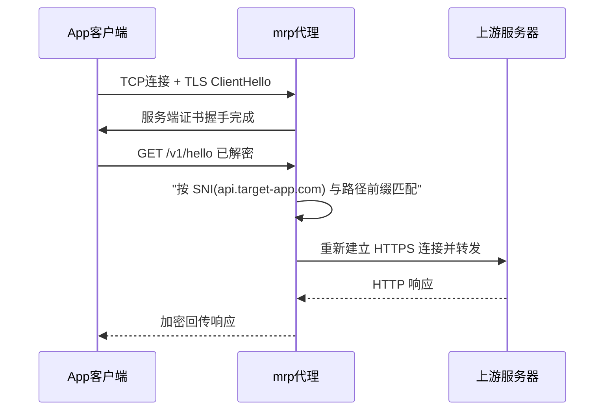

# 我的反向代理 (mrp)

Go 实现的本地反向代理。单一端口同时处理 HTTP / HTTPS（按连接首字节自动识别），依据 YAML 路由配置按域名（SNI / Host）与路径前缀转发。用于把移动 App 固定访问的域名劫持转发到自有服务器联调。

## 原理

目标 App 通过 HTTPS 访问固定域名（如 `api.target-app.com`）。mrp 用自签 CA 签发一张服务端证书（SAN 覆盖所有要拦截的域名），把 CA 导入设备信任后，将设备流量引导到 mrp——hosts / DNS 重定向让 App 直连 mrp，或把设备代理指向 mrp 的 CONNECT。

核心是 MITM：App 发来 TLS ClientHello，mrp 用服务端证书冒充目标域名完成握手，客户端因信任本地 CA 而验证通过，于是 mrp 拿到解密后的明文 HTTP：



随后按 SNI / Host 与路径前缀匹配路由，转发到真实上游，未匹配的域名透传原目标；上游为 HTTPS 时默认校验其证书，可用 `tls_verify: false` 关闭。纯 HTTP 连接（同一端口按首字节识别）不经 TLS 握手，直接按 Host 头路由；显式代理的 CONNECT 则先返回「200 Connection Established」建立隧道，命中域名再走上述 MITM 流程。

## 使用流程

### 1. 准备 CA 证书和私钥

```bash
mkdir -p certs

# 生成自签 CA（设备需信任它）
openssl req -x509 -newkey ec -pkeyopt ec_paramgen_curve:P-256 \
  -keyout certs/ca.key -out certs/ca.crt -nodes -days 3650 \
  -subj "/CN=DeviceProxy CA"

# 生成服务端私钥与证书请求
openssl req -newkey ec -pkeyopt ec_paramgen_curve:P-256 \
  -keyout certs/server.key -out certs/server.csr -nodes \
  -subj "/CN=api.target-app.com"

# 写入 SAN（覆盖全部要拦截的域名）
printf "subjectAltName=DNS:api.target-app.com,DNS:cdn.target-app.com\n" > certs/san.cnf

# 用 CA 签发服务端证书（有效期 825 天）
openssl x509 -req -in certs/server.csr -CA certs/ca.crt -CAkey certs/ca.key \
  -CAcreateserial -out certs/server.crt -days 825 -extfile certs/san.cnf
```

### 2. 导入 CA 证书

把 `certs/ca.crt` 导入客户端设备，使其信任 mrp 签发的证书。

#### Android

- **用户证书**：设置 → 安全 → 更多安全设置 → 加密与凭据 → 安装证书 → CA 证书
- **系统证书（需 Root）**：Android 7.0+ 第三方 App 默认不信任用户证书，需装入系统证书存储

  ```bash
  HASH=$(openssl x509 -subject_hash_old -in certs/ca.crt | head -1)
  adb push certs/ca.crt /data/local/tmp/${HASH}.0
  adb shell "su -c 'mount -o rw,remount /system && \
    cp /data/local/tmp/${HASH}.0 /system/etc/security/cacerts/ && \
    chmod 644 /system/etc/security/cacerts/${HASH}.0'"
  ```

#### Windows

```bash
# 当前用户（免管理员）
certutil -user -addstore Root certs\ca.crt

# 或机器全局（需管理员）
certutil -addstore Root certs\ca.crt
```

#### Linux

```bash
# Debian / Ubuntu：装入系统信任并刷新
sudo cp certs/ca.crt /usr/local/share/ca-certificates/mrp-ca.crt
sudo update-ca-certificates
```

也可以用 `curl --cacert certs/ca.crt` 临时信任，无需系统导入。

### 3. 初始化配置文件

创建 `routing.yaml`：

```yaml
servers:
  - domain: api.target-app.com
    routes:
      - prefix: /v1/
        upstream: https://our-server-a.com/v1/
      - prefix: /
        upstream: http://192.168.1.50:8080
        host: our-server-b.com
  - domain: cdn.target-app.com
    routes:
      - prefix: /
        upstream: https://our-server-b.com
        tls_verify: false
```

字段说明：

| 字段 | 说明 |
|------|------|
| `servers[].domain` | 按域名精确匹配，HTTPS 用 SNI、HTTP 用 Host 头 |
| `routes[].prefix` | 最长路径前缀匹配 |
| `routes[].upstream` | 上游地址，路径前缀自动映射 |
| `routes[].host` | 可选，改写转发时的 Host 头 |
| `routes[].tls_verify` | 可选，默认 true，false 跳过 HTTPS 上游证书校验 |

未匹配的域名透传原目标。修改 `routing.yaml` 后自动热加载，无需重启。

### 4. 启动服务

```bash
go build -trimpath -ldflags "-s -w" -o mrp .

./mrp --config routing.yaml --listen :443 \
  --tls-cert certs/server.crt --tls-key certs/server.key
```

命令行参数：

| 参数 | 默认 | 说明 |
|------|------|------|
| `--config` | `routing.yaml` | 路由配置文件路径 |
| `--listen` | `:443` | 监听地址 |
| `--tls-cert` / `--tls-key` | — | TLS 证书/私钥，成对提供；缺省时仅支持 HTTP 与 CONNECT 隧道 |
| `--log-level` | `info` | debug / info / warn / error |

### 5. 测试验证

```bash
# 直连 HTTPS（域名解析到本机，mrp 终结 TLS 后转发）
curl --cacert certs/ca.crt --resolve api.target-app.com:443:127.0.0.1 \
  https://api.target-app.com/v1/hello

# 纯 HTTP（同一端口，自动识别）
curl --resolve api.target-app.com:443:127.0.0.1 \
  http://api.target-app.com:443/v1/hello

# 显式代理（CONNECT）
curl -x http://127.0.0.1:443 --cacert certs/ca.crt \
  https://api.target-app.com/v1/hello
```

观察 mrp 日志（`domain` / `path` / `upstream` / `status` / `elapsed`）确认路由命中与转发结果；上游不可达时返回 502。