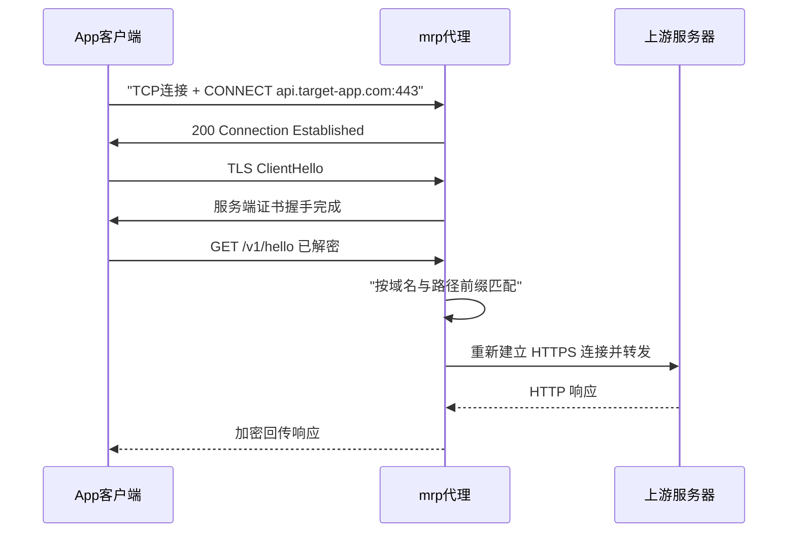

# 我的反向代理 (mrp)

Go 实现的本地反向代理。只监听一个端口（`--port`，默认 8000）：HTTP 请求按 Host 头与路径前缀路由转发，HTTPS 经 CONNECT 进入，命中配置的域名时做 MITM 解密后按同样规则路由，未命中的域名直接透传隧道。用于把移动 App 固定访问的域名劫持转发到自有服务器联调。

## 原理

目标 App 通过 HTTPS 访问固定域名（如 `api.target-app.com`）。mrp 持有一张自签 CA，在 TLS 握手时按客户端 SNI 实时签发对应域名的服务端证书，把 CA 导入设备信任后，将设备代理指向 mrp——HTTPS 走 CONNECT 隧道，mrp 在其中完成 MITM；也可以把域名解析重定向到 mrp，直接以明文 HTTP 形式到达。

核心是 MITM：客户端经 CONNECT 建立隧道后发来带 SNI 的 TLS ClientHello，mrp 用 CA 即时签发一张 SAN 为该 SNI 的服务端证书，代替目标域名完成握手；客户端因信任本地 CA 而验证通过，mrp 由此获得解密后的明文 HTTP：


```mermaid
sequenceDiagram
    participant App as App客户端
    participant mrp as mrp代理
    participant Up as 上游服务器

    App->>mrp: "TCP连接 + CONNECT api.target-app.com:443"
    mrp->>App: 200 Connection Established
    App->>mrp: TLS ClientHello
    mrp->>App: 服务端证书握手完成
    App->>mrp: GET /v1/hello 已解密
    mrp->>mrp: "按域名与路径前缀匹配"
    mrp->>Up: 重新建立 HTTPS 连接并转发
    Up-->>mrp: HTTP 响应
    mrp-->>App: 加密回传响应
```

随后按域名与路径前缀匹配路由，转发到真实上游，未匹配的域名透传原目标；上游为 HTTPS 时 mrp 跳过其证书校验，校验交由设备端信任的 CA 链路完成。明文 HTTP 连接（域名解析到 mrp 或经代理的 HTTP 请求）不做 TLS 握手，直接按 Host 头路由；显式代理的 CONNECT 未命中配置域名时同样返回「200 Connection Established」，但只搬运字节不做解密。

## 使用流程

### 1. 准备 CA 证书和私钥

生成一张自签 CA，mrp 会用它按 SNI 动态签发各域名的服务端证书，因此 CA 本身无需预写拦截域名：

```bash
openssl req -x509 -newkey ec -pkeyopt ec_paramgen_curve:P-256 \
  -keyout ca.key -out ca.crt -nodes -days 3650 \
  -subj "/CN=DeviceProxy CA" \
  -addext "basicConstraints=critical,CA:TRUE" \
  -addext "keyUsage=critical,keyCertSign,digitalSignature"
```

### 2. 导入 CA 证书

把 `ca.crt` 导入客户端设备，使其信任 mrp 签发的证书。

#### Android

- **用户证书**：设置 → 安全 → 更多安全设置 → 加密与凭据 → 安装证书 → CA 证书。用户证书仅对信任用户 CA 的应用生效；Android 7.0+ 应用默认只信任系统证书，需在应用侧放行用户证书（`network_security_config` 的 `trust-anchors` 加入 `user`）
- **系统证书（需 Root）**：将证书命名为 `<subject_hash>.0`，推送到 `/system/etc/security/cacerts/`：

  ```bash
  HASH=$(openssl x509 -subject_hash_old -in ca.crt | head -1)

  # adbd 以 root 运行并重新挂载 /system 为可写
  adb root
  adb remount

  # 直接推送到系统证书目录
  adb push ca.crt /system/etc/security/cacerts/${HASH}.0
  adb shell chmod 644 /system/etc/security/cacerts/${HASH}.0
  ```

#### HarmonyOS

OpenHarmony 系统 CA 证书位于 `/etc/security/certificates`，开发者模式（或 Root）下可直接推送，命名沿用 `<subject_hash>.0`：

```bash
HASH=$(openssl x509 -subject_hash_old -in ca.crt | head -1)
hdc file send ${HASH}.0 /etc/security/certificates
```

#### Windows

```bash
# 当前用户（免管理员）
certutil -user -addstore Root ca.crt

# 或机器全局（需管理员）
certutil -addstore Root ca.crt
```

#### Linux

```bash
# Debian / Ubuntu：装入系统信任并刷新
sudo cp ca.crt /usr/local/share/ca-certificates/mrp-ca.crt
sudo update-ca-certificates
```

也可以用 `curl --cacert ca.crt` 临时信任，无需系统导入。

### 3. 初始化配置文件

mrp 首次运行会自动在当前目录创建 `config.yaml`（含注释模板），按需编辑：

```yaml
# 上游域名解析用的 DNS 服务器，缺省 114.114.114.114 与 8.8.8.8
nameservers:
  - "114.114.114.114"
  - "8.8.8.8"
# 每条 server 是一个虚拟服务器：mrp 只监听一个端口（--port），protocol 与 port
# 只用于决定哪个请求归属该 server，不参与监听。protocol 省略匹配任意协议，
# port 省略匹配任意端口；同一域名可声明多个 server 分别匹配不同协议与端口
servers:
  - domain: api.target-app.com
    routes:
      - prefix: /v1/
        upstream: https://api.our-server.com/v1/
        host: api.our-server.com
        headers:
          request:
            Authorization: "Bearer token"
          response:
            Access-Control-Allow-Origin: "*"
            Access-Control-Allow-Methods: "GET, POST, OPTIONS"
      - prefix: /assets/
        upstream: ./dist
      - prefix: /
        upstream: http://192.168.1.50:8080
  - domain: admin.target-app.com
    routes:
      - prefix: /
        upstream: http://127.0.0.1:9000
```

字段说明：

| 字段 | 说明 |
|------|------|
| `servers[].domain` | 按域名匹配（大小写不敏感），HTTPS 用 CONNECT 目标主机、HTTP 用 Host 头 |
| `servers[].protocol` | 可选，请求协议 `http` 或 `https`，省略匹配任意协议；不参与监听，mrp 始终在 `--port` 上监听明文连接 |
| `servers[].port` | 可选，请求目标端口，省略匹配任意端口；不参与监听，mrp 始终在 `--port` 上监听 |
| `routes[].prefix` | 最长路径前缀匹配，必须以 `/` 开头 |
| `routes[].upstream` | 上游地址，路径前缀自动映射；也支持本地目录路径（相对进程工作目录，托起静态文件，目录命中回退 `index.html`） |
| `routes[].host` | 可选，改写转发时的 Host 头 |
| `routes[].headers.request` | 可选，改写发往上游的请求头（Set 语义，覆盖同名已有值） |
| `routes[].headers.response` | 可选，覆盖下游返回的响应头（如跨域校验头 `Access-Control-Allow-*`） |
| `nameservers` | 顶层字段，上游域名解析用的 DNS 服务器列表；支持裸 IP（默认 53 端口）与 `host:port`、`[::1]:5353` 写法，按顺序故障切换，单次尝试超时由 `--dns-timeout` 控制。解析结果按 `host:port` 缓存 `--dns-ttl` 时长，避免每条新上游连接重复发查询；`nameservers` 或路由变更时缓存整体清空。缺省 `114.114.114.114` 与 `8.8.8.8` |

Android / HarmonyOS 设备上的 `/etc/resolv.conf` 常把 nameserver 指向 `[::1]` 或网关等非标准地址（解析交给 netd 等守护进程完成），mrp 自带的 Go DNS 解析器读不到有效服务器时上游域名会解析失败，报 `read udp ...->[::1]:53: connection refused`。因此设备部署时必须显式配置 `nameservers`。

未匹配的域名透传原目标。修改 `config.yaml` 后自动热加载，无需重启；只有路由或 `nameservers` 真正变化时才重建转发、拆掉旧的上游连接并清空 DNS 解析缓存，改注释不会打断已有连接。

### 4. 启动服务

从 GitHub Releases 下载对应平台的静态二进制，免本地编译（`latest` 为每次构建自动发布的预发布包，`v*` 为正式版）：

```bash
# Linux / HarmonyOS / Android 设备本机（linux/arm64 静态产物）
wget https://github.com/isunk/MyReverseProxy/releases/download/latest/mrp-linux-arm64

# Windows（amd64）
curl -LO https://github.com/isunk/MyReverseProxy/releases/download/latest/mrp-windows-amd64.exe

# Windows 一键部署脚本（可选，内置固定 CA，无需 openssl；支持提权导入与设备安装）
curl -LO https://github.com/isunk/MyReverseProxy/releases/download/latest/mrp.bat
```

在 `--port` 指定的端口（默认 8000）监听，加载 `ca.crt` / `ca.key`：

```bash
# Linux / HarmonyOS / Android 设备本机
chmod +x mrp-linux-arm64
./mrp-linux-arm64
```

Windows 下命令行运行 `mrp-windows-amd64.exe` 即可，或下载 `mrp.bat` 双击运行：脚本内置一份固定 CA（`ca.crt` 哈希 `d6cd00d8`，无需 openssl），Windows 侧提供 install（准备文件+导入 CA）、start（运行+设代理）、stop（杀进程+清代理）、uninstall（卸载+删 CA+删文件）；Android(adb)/HarmonyOS(hdc) 设备侧工作目录统一为 `/data/local/mrp`，提供 install（推文件+装 CA）、start（运行+设代理）、sync config（把本地 config.yaml 同步到设备）、stop（杀进程+清代理）、uninstall（卸载+删 CA+删整个工作目录）。设备菜单统一展示证书状态（是否安装）、应用状态（未安装/已安装未运行/已运行）、代理状态（adb 可查询，hdc 因无可验证命令显示 Unknown）。

命令行参数：

| 参数 | 默认 | 说明 |
|------|------|------|
| `--port` | `8000` | 唯一监听端口，1-65535；须与设备代理端口一致；默认值在 1024 以上，无需管理员或 root 权限 |
| `--config` | `config.yaml` | 路由配置文件路径；未指定时缺失则自动创建 |
| `--cert` / `--key` | `ca.crt` / `ca.key` | CA 证书/私钥，成对提供；mrp 按客户端 SNI 动态签发服务端证书；缺省时无法 MITM，命中配置的 CONNECT 目标返回 502，其余域名仍走透传隧道 |
| `--log` | `info` | debug / info / warn / error |
| `--dns-timeout` | `1s` | 单个 DNS 服务器的解析尝试超时，超时后切到下一个 `nameservers` |
| `--dns-ttl` | `30s` | 上游 `host:port` 解析结果的缓存时长，`0` 关闭缓存改为每次连接都解析 |

### 5. 测试验证

```bash
# 显式代理：CONNECT 命中配置域名则 MITM 后路由转发
curl -x http://127.0.0.1:8000 --cacert ca.crt \
  https://api.target-app.com/v1/hello

# 显式代理：CONNECT 未命中配置域名则透传隧道（无需 cacert）
curl -x http://127.0.0.1:8000 https://www.example.com/

# 直连：域名解析到 mrp 监听端口，按 Host 头路由转发
curl --resolve api.target-app.com:8000:127.0.0.1 \
  http://api.target-app.com:8000/v1/hello
```

观察 mrp 日志（`domain` / `path` / `upstream` / `status` / `elapsed`）确认路由命中与转发结果；上游不可达时返回 502。

日志格式为 `MM-dd HH:mm:ss.SSS\t级别\t消息+参数`，例如：

```text
09-28 09:21:36.865	INFO	created default config file path=config.yaml
```

整行按级别着色（仅终端输出时着色，重定向到文件为纯文本）：DEBUG 灰、INFO 普通色、WARN 黄、ERROR 红。

### 6. 各平台设备对接代理

mrp 可跑在设备本机（代理地址填 `127.0.0.1`，免局域网依赖），也可跑在 PC 上（代理地址填 PC 的局域网 IP）。监听端口由 `--port` 指定（默认 8000），须与代理地址端口一致。

#### Android

```bash
# --- 设备本机运行（linux/arm64 静态产物，Android 直接执行） ---
adb shell mkdir -p /data/local/mrp
adb push mrp-linux-arm64 /data/local/mrp/

# 路由配置，按需推送
adb push config.yaml /data/local/mrp/
adb shell chmod +x /data/local/mrp/mrp-linux-arm64

# 前台输出日志，Ctrl+C 结束
adb shell "cd /data/local/mrp && ./mrp-linux-arm64"

# 全局代理指向本机
adb shell settings put global http_proxy 127.0.0.1:8000

# 取消代理
adb shell settings put global http_proxy :0
```

也可以让 mrp 跑在 PC 上，设备代理填 PC 的局域网 IP：

```bash
# 设置全局 HTTP 代理（IP 换成 mrp 所在机器的局域网地址）
adb shell settings put global http_proxy 192.168.1.100:8000

# 取消代理
adb shell settings put global http_proxy :0
```

部分 App 自实现网络栈、忽略系统代理，这类 App 需改用 hosts / DNS 重定向方式。

#### HarmonyOS

```bash
# --- mrp 跑在设备本机（linux/arm64 静态产物） ---
hdc shell mkdir -p /data/local/mrp
hdc file send ca.key /data/local/mrp/
hdc file send ca.crt /data/local/mrp/

# 路由配置，按需推送
hdc file send config.yaml /data/local/mrp/
hdc file send mrp-linux-arm64 /data/local/mrp/
hdc shell "chmod +x /data/local/mrp/mrp-linux-arm64"

# 运行（前台输出日志，Ctrl+C 结束）
hdc shell "cd /data/local/mrp && ./mrp-linux-arm64"

# 全局代理指向本机
hdc shell network-cfg set http_proxy 127.0.0.1:8000

# 取消代理
hdc shell network-cfg set http_proxy 0
```

#### Windows

```bash
# 设置 WinHTTP 系统代理（服务与部分命令行工具生效）
netsh winhttp set proxy 192.168.1.100:8000

# 取消代理
netsh winhttp reset proxy
```

浏览器与多数桌面应用走 WinINET（GUI）：设置 → 网络和 Internet → 代理 → 手动设置代理，填入 `192.168.1.100:8000`（端口取 `--port`，默认 8000），关闭时切回「自动检测」。

也可以只让单个 Chrome 实例走代理（不影响系统设置，关闭窗口即结束）：

```bash
"C:\Program Files\Google\Chrome\Application\chrome.exe" --proxy-server="http://127.0.0.1:8000" "https://api.target-app.com/v1/"
```

#### Linux

```bash
# 设置会话级代理（curl 等命令行工具生效）
export http_proxy=http://192.168.1.100:8000 https_proxy=http://192.168.1.100:8000

# 取消代理
unset http_proxy https_proxy
```